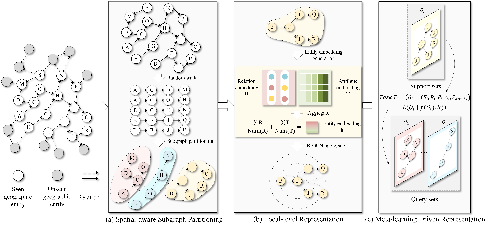

# SMRL

This repository contains the official PyTorch/DGL code for the IEEE Transactions on Neural Networks and Learning Systems article **Spatial Meta-Learning-Based Representation for Unseen Geographic Entities**.

Paper DOI: [10.1109/TNNLS.2026.3679789](https://doi.org/10.1109/TNNLS.2026.3679789)  
IEEE Xplore: [Spatial Meta-Learning-Based Representation for Unseen Geographic Entities](https://ieeexplore.ieee.org/document/11477853/)

The implementation provides the SMRL pipeline for spatial-aware subgraph partitioning, local relation-attribute aggregation, and meta-learning driven representation of unseen geographic entities.



## Method

SMRL follows three stages:

1. Spatial-aware subgraph partitioning samples local support/query tasks from the known geographic graph.
2. Local-level representation initializes each entity with relation and attribute context.
3. Meta-learning driven representation trains transferable modules and fine-tunes them on unseen geographic entities.

The important implementation change in this version is the local entity initialization:

```text
h = mean(R) + mean(T)
```

where `R` is the set of incoming relation embeddings and `T` is the set of attribute embeddings. Attribute facts are extracted from non-entity-object triples and semantic metadata relations such as `rdf:type`, `rdfs:label`, `RegionId`, and `worldkg.org/schema/*`. Attribute keys are represented as `(predicate, object)` pairs.

## Requirements

The original experiments were developed with:

```text
torch==1.7.1
dgl==0.6.1
lmdb
numpy
tensorboard
tqdm
```

Install the Python dependencies with:

```bash
pip install -r requirements.txt
```

Choose the PyTorch and DGL builds that match your CUDA environment.

## Data Format

Each split file uses one triple per line:

```text
<head>*<relation>*<tail>
```

The preprocessor also supports the legacy `^` separator. Known and unseen datasets are stored as separate folders. For example:

```text
data/region_v6/train.txt
data/region_v6/valid.txt
data/region_v6/test.txt
data/region_6_ind/train.txt
data/region_6_ind/valid.txt
data/region_6_ind/test.txt
```

Small runnable format examples are provided in `data/sample_region_v6` and `data/sample_region_6_ind`. Full datasets and generated artifacts are intentionally not committed.

## Training

Meta-train on the known graph and evaluate/fine-tune on the unseen graph:

```bash
python main.py \
  --data_name region_v6 \
  --ind_data_name region_6_ind \
  --name region_v6_complex_smrl \
  --step meta_train \
  --kge ComplEx \
  --gpu cuda:0 \
  --use_attr true
```

Fine-tune from the meta-trained checkpoint:

```bash
python main.py \
  --data_name region_v6 \
  --ind_data_name region_6_ind \
  --name region_v6_complex_smrl_finetune \
  --metatrain_state ./state/region_v6_complex_smrl/region_v6_complex_smrl.best \
  --step fine_tune \
  --kge ComplEx \
  --gpu cuda:0 \
  --use_attr true
```

The helper scripts in `script/` contain the same commands. Cached pickle files and LMDB subgraph databases are generated automatically under `data/`.

## Notes

- `--ind_data_name` can be used to explicitly bind a known graph to its unseen graph. If omitted, `region_v6` is automatically matched with `region_6_ind` when that folder exists.
- `--num_attr` is normally detected during preprocessing. Override it only when you need checkpoint compatibility experiments.
- New attribute-aware checkpoints include `attr_emb.weight`. Older relation-only checkpoints can be loaded for fine-tuning with the attribute embeddings randomly initialized, but retraining is recommended for reproducible SMRL results.
- Generated outputs in `state/`, `log/`, `tb_log/`, `data/*.pkl`, and `data/*_attr_subgraph/` are ignored by Git.

## Citation

If this code or the SMRL method helps your work, please cite:

```bibtex
@ARTICLE{11477853,
  author={Li, Shengwen and Xu, Zhouzheng and Chen, Renyao and Zhu, Jiarui and Ye, Yaqin and Zhou, Shunping and Yao, Hong},
  journal={IEEE Transactions on Neural Networks and Learning Systems},
  title={Spatial Meta-Learning-Based Representation for Unseen Geographic Entities},
  year={2026},
  volume={},
  number={},
  pages={1-13},
  keywords={Earth Observing System;Satellite images;Weapons of mass destruction;Spread spectrum communication;Internet;Location awareness;LoRa;Mobile communication;Semantic Web;Communication systems;Geographic entity;meta-learning;representation learning},
  doi={10.1109/TNNLS.2026.3679789}
}
```

