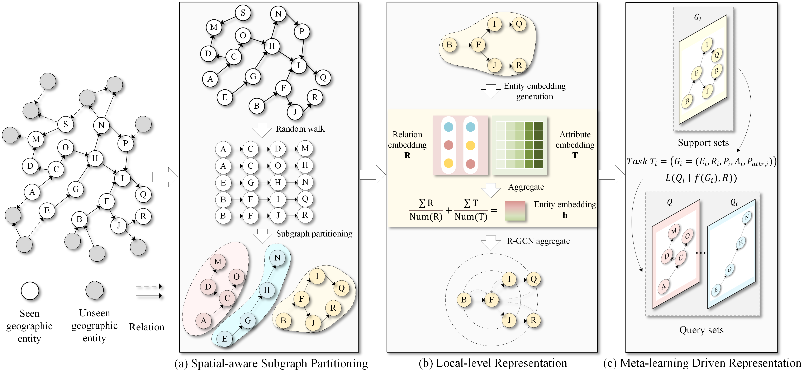

<div align="center">

# SMRL

## Spatial Meta-Learning-Based Representation for Unseen Geographic Entities

**IEEE Transactions on Neural Networks and Learning Systems (TNNLS), 2026**

Shengwen Li · **Zhouzheng Xu** · Renyao Chen · Jiarui Zhu · Yaqin Ye · Shunping Zhou · Hong Yao

<br />

<a href="https://doi.org/10.1109/TNNLS.2026.3679789"></a>
<a href="https://ieeexplore.ieee.org/document/11477853/"></a>


</div>

---

> **TL;DR:** SMRL learns transferable representations for geographic entities that were not observed during training. It builds spatially coherent meta-learning tasks, aggregates local relational and attribute context, and adapts the learned representation modules to an unseen geographic graph.



## Highlights

- **Unseen geographic entities.** The target entities and their local graph context are introduced after representation learning on the known graph.
- **Spatially aware task construction.** Random-walk subgraphs form local support/query episodes instead of treating the geographic knowledge graph as an unstructured collection of triples.
- **Relation–attribute initialization.** Each entity combines incoming relation context with semantic attribute context before graph propagation.
- **Transfer through meta-learning.** SMRL optimizes representation modules across local tasks, then fine-tunes them for the unseen graph.

## Method at a Glance

| Stage | Purpose | Implementation |
|---|---|---|
| **1. Spatial task construction** | sample local training episodes from the known geographic graph | `subgraph.py`, `datasets.py` |
| **2. Local representation** | initialize and propagate entity context from relations and attributes | `new_ent_init_model.py`, `rgcn_model.py` |
| **3. Meta-train and adapt** | learn transferable parameters and fine-tune on unseen entities | `meta_trainer.py`, `post_trainer.py` |

For an entity with incoming relation embeddings `R` and attribute embeddings `T`, the initializer uses:

```text
h = mean(R) + mean(T)
```

Attribute facts include non-entity-object triples and semantic metadata relations such as `rdf:type`, `rdfs:label`, `RegionId`, and `worldkg.org/schema/*`. Attribute keys are indexed as `(predicate, object)` pairs.

## Installation

The reference environment uses Python with:

```text
torch==1.7.1
dgl==0.6.1
lmdb>=0.99
numpy>=1.19.0
tensorboard>=2.4.0
tqdm>=4.60.0
```

Install the listed dependencies, selecting PyTorch and DGL builds that match your CUDA runtime:

```bash
pip install -r requirements.txt
```

## Data Preparation

Place the known and unseen graph folders under `data/`:

```text
data/
├── region_v6/
│   ├── train.txt
│   ├── valid.txt
│   └── test.txt
└── region_6_ind/
    ├── train.txt
    ├── valid.txt
    └── test.txt
```

Each file contains one triple per line:

```text
<head>*<relation>*<tail>
```

The parser accepts both `*` and `^` separators. See `data/sample_region_v6` and `data/sample_region_6_ind` for format examples. The first run creates cached pickle files and LMDB subgraph databases under `data/`.

## Training

### 1. Meta-train on the known graph

```bash
python main.py \
  --data_name region_v6 \
  --ind_data_name region_6_ind \
  --name region_v6_ComplEx_smrl \
  --step meta_train \
  --kge ComplEx \
  --gpu cuda:0 \
  --use_attr true
```

### 2. Fine-tune on the unseen graph

```bash
python main.py \
  --data_name region_v6 \
  --ind_data_name region_6_ind \
  --name region_v6_ComplEx_smrl_finetune \
  --metatrain_state ./state/region_v6_ComplEx_smrl/region_v6_ComplEx_smrl.best \
  --step fine_tune \
  --kge ComplEx \
  --gpu cuda:0 \
  --use_attr true
```

Equivalent launchers are provided in `script/metatrain.sh` and `script/finetune.sh`. Outputs are written to `state/`, `log/`, and `tb_log/`.

## Configuration Notes

- `--ind_data_name` explicitly binds a known graph to its unseen graph. If omitted, `region_v6` is matched with `region_6_ind` when that folder exists.
- `--num_attr` is detected during preprocessing. Set it manually only when loading a checkpoint with a fixed attribute vocabulary.
- `--attr_weight` controls the contribution of aggregated attribute embeddings.
- `--force_preprocess` rebuilds the cached graph and attribute indices.

## Citation

If SMRL is useful in your research, please cite:

```bibtex
@article{li2026smrl,
  author  = {Li, Shengwen and Xu, Zhouzheng and Chen, Renyao and Zhu, Jiarui and Ye, Yaqin and Zhou, Shunping and Yao, Hong},
  title   = {Spatial Meta-Learning-Based Representation for Unseen Geographic Entities},
  journal = {IEEE Transactions on Neural Networks and Learning Systems},
  year    = {2026},
  pages   = {1--13},
  doi     = {10.1109/TNNLS.2026.3679789}
}
```
